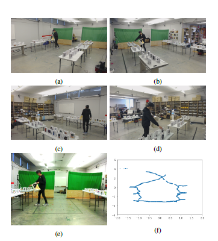
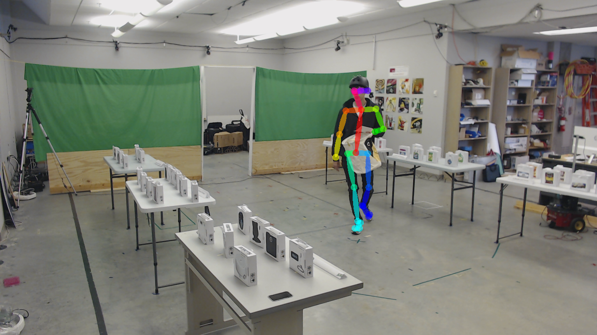
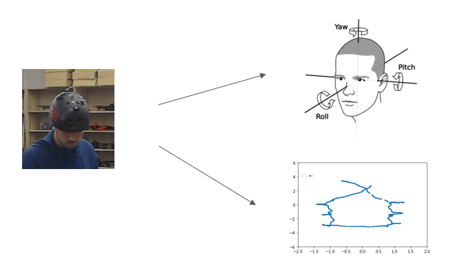

# intent-inference
### Sample data for IROS2020 submission: Inferring Human Navigational Intent through Multimodal Perception with Hybrid Neural Network

##### Sample image data:
These images are captured by webcams and robot's camera.

##### Sample extracted featrue from image data:
Images are processed by OpenPose to extract human body pose.

The body pose keypoints are then stored in a JSON file: [0_keypoints.json](https://github.com/zhitianz/intent-inference/blob/master/0_keypoints.json).
For all frames in a recording, the keypoints are saved in one CSV file: [keypoints.csv](https://github.com/zhitianz/intent-inference/blob/master/keypoints.csv).

##### Sample motion capture data:

Our motion capture data contains 2 parts:
1. Head position
2. Head orientation

For example, head position data are stored in [vicon_hat_4_hat_4_translation.csv](https://github.com/zhitianz/intent-inference/blob/master/vicon_hat_4_hat_4_translation.csv)
|Frame |X |Y |Z |
|---|---|---|---|
0 |0.3928178497984502 |0.7167165492762879 |1.847175367432085 |

And head orientation data are stored in [vicon_hat_4_hat_4_orientation.csv](https://github.com/zhitianz/intent-inference/blob/master/vicon_hat_4_hat_4_orientation.csv)
|Frame |Roll |Pitch |Yaw |
|---|---|---|---|
0 |-0.12083437270945468 |0.02716215219414442 |0.7919105034594937 |

They are then merged togther in [merged.csv](https://github.com/zhitianz/intent-inference/blob/master/merged.csv)
|Frame |X |Y |Roll |Pitch |Yaw |
|---|---|---|---|---|---|
0 |0.3928178497984502 |0.7167165492762879 |-0.12083437270945468 |0.02716215219414442 |0.7919105034594937 |

For the IROS2020 submission, we gathered around 50K frames and these features can be downloaded here:
[datax_im3_timestep10_10.csv](https://drive.google.com/file/d/1M0wXy1s9IQQpZ0ZAbSLjioXZZLk57njU/view?usp=sharing)
[datay_im3_timestep10_10.csv](https://drive.google.com/file/d/1ojPuhh0n9UcEnFxuSQgPzKvOw7iAeKjh/view?usp=sharing)

